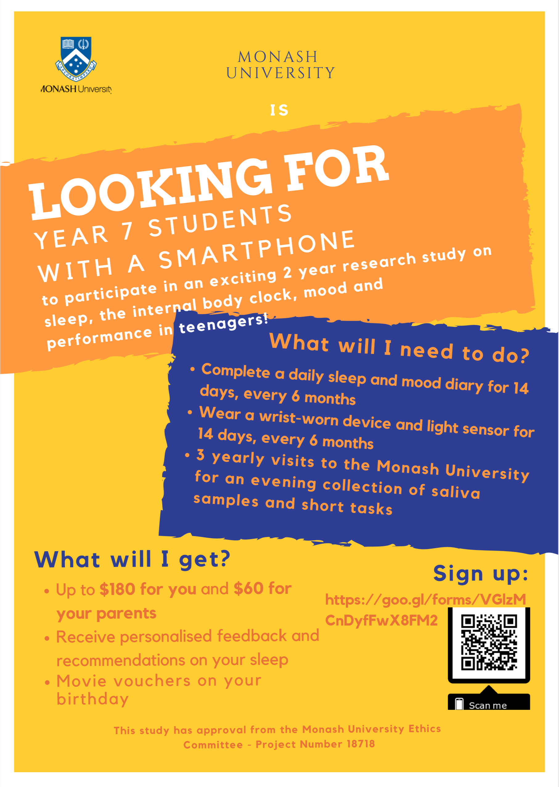

**Are you interested in how sleep and light affect academic performance?**

We are looking for current year 7 students with regular access to a
smartphone to participate in an exciting 2-year research study
investigating how sleep, light and the internal body clock interact
with academic performance and mood in teenagers. 

What will the project involve?

- Completing a daily sleep diary for 14 days, every 6 months
- Wearing an actiwatch for 14 days, for 6 months
- 3 annual visits to Monash University for an evening collection of
saliva samples and short cognitive tasks

**What will I get?**

- up to $180 for adolescents and $60 for parents
- receive personalised feedback and recommendations on adolescent sleep
- movie vouchers on your birthday

If you would like to participate, please complete
the survey [here](https://goo.gl/forms/VGlzM CnDyfFwX8FM2). 

Consent from a parent/legal guardian is required to participate in this research.
If you have any questions please email
[base.class@monash.edu](base.class@monash.edu)

